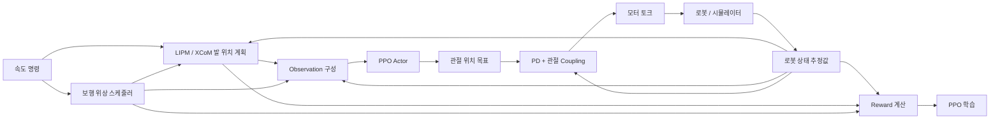

# LIPM 기반 Humanoid RL 데이터 및 제어 구조

이 문서는 `humanoid_controller` task를 기준으로 LIPM 보행 계획, RL policy, 상태 취득, 토크 제어 및 reward 계산에 사용되는 데이터를 정리한다.

## 전체 데이터 흐름



## 모듈별 입출력

| 모듈 | 입력 | 출력 | 비고 |
|---|---|---|---|
| 속도 명령 | 명령 범위 또는 사용자 입력 | 목표 `(vx, vy, yaw-rate)` | 현재 yaw-rate 범위는 0 |
| 상태 취득 | Isaac Gym 물리 상태 | Base, joint, foot, contact 상태 | 실제 estimator가 아닌 simulator ground truth |
| 상태 가공 | Base quaternion, joint state, foot pose | CoM, heading, 중력 방향, 발 상태 | 실제 시스템의 estimator 및 FK 역할 |
| 보행 위상 | Counter, step period | Phase, swing/support foot | 시간 기준 좌우 교대 |
| LIPM/XCoM | CoM, base 속도, support foot, 속도 명령 | 다음 발 목표 `(x, y, heading)` | 월드 좌표계에서 계산 |
| 발 목표 후처리 | 양발 목표 위치 | 충돌 보정 발 목표 | 양발 간격 최소 0.2 m |
| Observation | 로봇 상태, 발 목표, 명령, phase | 52차원 policy 입력 | Actor와 critic 구성 동일 |
| PPO Actor | 52차원 observation | 10차원 관절 목표 오프셋 | 위치 기반 action |
| 목표각 변환 | Action, 기본 관절 자세 | 절대 목표 관절각 | `q_des = default_q + action` |
| 저수준 제어 | 목표각, 현재각, 관절속도 | 모터 토크 10개 | PD 및 무릎-발목 coupling |
| Reward | Base, joint, contact, 발 목표 상태 | Scalar reward | PPO 학습에 사용 |
| PPO Critic | 52차원 상태 | 상태가치 `V(s)` | Privileged observation 없음 |
| PPO 학습 | Observation, action, reward, done, value | Actor/Critic 파라미터 | PPO + GAE |

## 상태 취득 및 추정

현재 레포에는 EKF나 실제 센서 기반 state estimator가 없다. Isaac Gym이 제공하는 정답 상태를 직접 사용한다.

| 원천 | 취득 데이터 | 가공 결과 | 사용처 |
|---|---|---|---|
| Floating base | 월드 base 위치 | Base height 및 planner 기준 위치 | Observation, termination |
| Floating base | Base quaternion | Heading, projected gravity | Observation, reward |
| Floating base | 월드 선속도 | 월드/base 선속도 | LIPM, observation, reward |
| Floating base | 월드 각속도 | Base-frame 각속도 | Observation, reward |
| Joint state | 관절각 10개 | Joint position | Observation, PD |
| Joint state | 관절속도 10개 | Joint velocity | Observation, PD, reward |
| Rigid-body state | 양발 위치 및 quaternion | 발 pose와 heading | LIPM, observation |
| Contact force | Body별 `(Fx, Fy, Fz)` | 발 접촉 및 충돌 여부 | Reward, termination |
| 질량 모델 | 링크 위치 및 질량 | 질량가중 CoM | LIPM |
| 내부 counter | 제어 step 수 | Phase, swing/support foot | Planner, observation, reward |

### 실제 로봇에서 필요한 estimator 출력

| 필요한 상태 | 생성 방법 |
|---|---|
| Base orientation quaternion | IMU orientation estimator |
| Base-frame angular velocity | IMU gyro |
| 월드/odom 선속도 | IMU + contact-aided EKF |
| Base height | Contact FK + base estimator |
| Joint position/velocity | Encoder + velocity filtering |
| 양발 pose | Base pose + joint FK |
| 양발 접촉 여부 | F/T 센서, 압력 센서 또는 접촉 추정 |
| CoM 위치 | Base pose + joint state + 질량 모델 |
| Support foot | 접촉 상태와 gait phase 조합 |

> LIPM planner는 CoM 위치를 사용하지만 속도는 CoM 속도가 아니라 floating base의 월드 선속도 `root_states[:, 7:9]`를 사용한다.

## 보행 위상

| 입력 | 처리 | 출력 |
|---|---|---|
| Policy counter | 35 step마다 발 목표 갱신 | 발 목표 갱신 신호 |
| Swing-foot mask | 갱신 시 좌우 반전 | Swing/support foot |
| Gait phase | 70 step마다 초기화 | 0~1 phase |
| Phase | `sin(2π phase)`, `cos(2π phase)` | Policy observation |
| Phase | Smooth square wave | 목표 접촉 패턴 |

| 주기 항목 | 값 |
|---|---|
| Physics 주기 | 1 kHz |
| Policy 주기 | 100 Hz |
| Decimation | 10 |
| 발 목표 갱신 주기 | 약 0.35초 |
| 전체 보행 주기 | 약 0.7초 |

Swing/support foot은 실제 착지 순간이 아니라 시간 기준으로 전환된다. 실제 접촉력은 발 위치 갱신과 reward 계산에 사용된다.

## LIPM/XCoM Planner

| 구분 | 데이터 | 기준 |
|---|---|---|
| 입력 | CoM 위치 `(x, y, z)` | 월드 |
| 입력 | Base 선속도 `(vx, vy)` | 월드 |
| 입력 | Support-foot 위치 `(x, y)` | 월드 |
| 입력 | 목표 속도 `(vx_cmd, vy_cmd)` | 월드 |
| 입력 | Step time | 약 0.35초 |
| 입력 | Step width | 0.3 m |
| 입력 | 중력 및 CoM 높이 | `ω = sqrt(g/zCoM)` |
| 입력 | Swing-foot 좌우 구분 | Boolean mask |
| 중간값 | Step 종료 시 예상 CoM 및 속도 | 월드 |
| 중간값 | End-of-step ICP/XCoM | 월드 |
| 출력 | Swing-foot 목표 `(x, y)` | 월드 |
| 출력 | 발 목표 heading | `atan2(vy_cmd, vx_cmd)` |
| 후처리 | 양발 간격 | 최소 0.2 m |

평지에서 planner 출력은 `(x, y, heading)`이다. 별도의 발 높이 목표는 없으며, policy observation으로 전달할 때 `(x, y, 0, heading)` 형태로 base 좌표계에 변환한다.

### 현재 활성 경로에서 사용되지 않는 계산

| 항목 | 현재 용도 |
|---|---|
| 별도 ICP 버퍼 | 값 자체는 사용되지 않지만 같은 함수가 LIPM의 `ω`를 설정 |
| Raibert heuristic | 대체 planner이며 비활성화 |
| LIPM CoM | 분석 및 plotting |
| 포물선 swing-foot 궤적 | 함수만 존재하고 호출되지 않음 |

## Policy Observation

Actor와 critic은 동일한 52차원 observation을 사용한다.

| 항목 | 차원 | 표현 |
|---|---:|---|
| Base height | 1 | 월드 z |
| Base linear velocity | 3 | 월드 `(vx, vy, vz)` |
| Base heading | 1 | 월드 yaw |
| Base angular velocity | 3 | Base `(wx, wy, wz)` |
| Projected gravity | 3 | Base 좌표계 중력 방향 |
| Right foot pose | 4 | Base 기준 `(x, y, z, heading)` |
| Left foot pose | 4 | Base 기준 `(x, y, z, heading)` |
| Right planned foothold | 4 | Base 기준 `(x, y, z=0, heading)` |
| Left planned foothold | 4 | Base 기준 `(x, y, z=0, heading)` |
| Velocity command | 3 | `(vx, vy, yaw-rate)` |
| Gait phase | 2 | `(sin phase, cos phase)` |
| Joint position | 10 | 양 다리 관절각 |
| Joint velocity | 10 | 양 다리 관절속도 |
| **합계** | **52** | |

### Policy에 직접 들어가지 않는 값

| 값 | 사용처 |
|---|---|
| CoM | LIPM planner |
| ICP/XCoM | 발 목표 계산 |
| 실제 foot contact | 발 상태 갱신 및 reward |
| 접촉력 | 접촉 판정 및 termination |
| Swing/support-foot mask | Planner 및 reward |
| 관절 토크 | Reward 및 actuator 입력 |
| Base 월드 x, y 위치 | Planner 및 좌표 변환 |

Actor 입력에는 uniform noise가 추가된 후 running mean/std normalization이 적용된다. Critic은 동일한 observation을 사용하지만 입력 noise는 추가하지 않는다.

## Action 및 모터 제어

| 단계 | 입력 | 출력 |
|---|---|---|
| Actor MLP | 52차원 observation | 10차원 action 평균 |
| 학습 | 평균과 학습 가능한 표준편차 | Gaussian sampled action |
| 실행 | Action 평균 | Deterministic action |
| Action clipping | Actor 출력 | `[-10, 10]` 제한 |
| 목표각 변환 | Action + 기본 자세 | 절대 관절 목표각 |
| PD 제어 | 목표각, 현재각, 관절속도 | 관절 토크 |
| Coupling | 무릎·발목 상태 및 목표 | Coupling 반영 토크 |
| Torque clipping | 계산 토크 | 최종 모터 토크 |

| 다리 | Action 관절 순서 |
|---|---|
| 오른쪽 | Hip yaw, hip ab/ad, hip pitch, knee, ankle |
| 왼쪽 | Hip yaw, hip ab/ad, hip pitch, knee, ankle |

```text
q_des = default_q + action
qd_des = 0
tau = Kp * (q_des - q) + Kd * (qd_des - qd)
```

현재 설정은 모든 관절에서 `Kp = 30`, `Kd = 1`이다. 계산된 토크는 coupling 변환 후 URDF effort limit으로 제한된다.

## Reward

일반 reward는 `reward function × weight × policy dt`로 누적된다. 종료 reward에는 policy dt가 곱해지지 않으며 음수 reward clipping은 사용하지 않는다.

| Reward | 측정 데이터 | 목적 | 가중치 |
|---|---|---|---:|
| Linear velocity tracking | 목표/실제 월드 `(vx, vy)` | 목표 속도 추종 | 4.0 |
| Base height | Base z | 0.62 m 유지 | 1.0 |
| Base heading | 이동 방향과 base yaw | 진행 방향 정렬 | 3.0 |
| Upright orientation | Projected gravity xy | Roll/pitch 억제 | 1.0 |
| Contact schedule | 발 접촉과 phase | 좌우 교대 접촉 | 3.0 |
| Support-foot accuracy | 발 위치와 발 목표 거리 | 목표 착지 위치 유지 | Contact reward에 포함 |
| Joint regularization | Hip yaw, hip ab/ad | 관절을 0 근처로 유지 | 1.0 |
| Vertical velocity | Base-frame vz | 상하 진동 억제 | 0.1 |
| Roll/pitch angular velocity | Base `(wx, wy)` | 몸통 흔들림 억제 | 0.01 |
| Joint velocity | 전체 관절속도 | 빠른 관절 운동 억제 | 0.001 |
| Torque magnitude | 전체 관절토크 | 큰 토크 억제 | 0.0001 |
| Action rate | 현재/이전 목표각 | 목표각 급변 억제 | 0.001 |
| Action acceleration | 최근 3개 목표각 | 목표각 2차 변화 억제 | 0.0001 |
| Joint position limits | 관절각과 soft limit | 관절 한계 초과 억제 | 10.0 |
| Torque limits | 토크와 soft limit | Torque limit 80% 초과 억제 | 0.01 |
| Termination | 낙상 및 비정상 상태 | 실패 종료 | -1 |

Swing foot과 발 목표 사이의 오차만 독립적으로 측정하는 reward는 없다. Contact schedule reward가 발 교대 접촉과 support-foot 목표 위치 정확도를 함께 평가한다.

## 종료 조건

| 조건 | 기준 |
|---|---|
| 금지 body 접촉 | Base, 허벅지, 종아리, 팔, 손 등의 접촉 |
| 과도한 선속도 | Base-frame 속도 norm > 10 m/s |
| 과도한 각속도 | Base-frame 각속도 norm > 5 rad/s |
| 과도한 기울기 | Projected gravity x 또는 y 절댓값 > 0.7 |
| 낮은 base | Base z < 0.3 m |
| 시간 제한 | Episode 5초 초과 |

## 기존 로봇과 맞춰야 할 인터페이스

| 인터페이스 | 현재 레포의 전제 |
|---|---|
| 월드 좌표계 | Z-up |
| LIPM 위치 | CoM과 발 위치 모두 월드 기준 |
| Observation 발 상태 | Base 기준 |
| Observation 발 목표 | Base 기준 |
| 선속도 | 월드 선속도 |
| 각속도 | Base-frame 각속도 |
| 관절 action | 기본 자세 기준 위치 오프셋 |
| 관절 순서 | 오른쪽 5축 후 왼쪽 5축 |
| 발 y 부호 | 오른발 음수, 왼발 양수 |
| 발 역할 전환 | 약 0.35초 시간 기준 |
| 발 접촉 | Vertical contact force가 0보다 크면 접촉 |
| CoM | 전체 링크 질량가중 위치 |
| Policy 주기 | 100 Hz |
| Torque 주기 | 1 kHz |
| 발계획 주기 | 약 2.86 Hz |

### 이식 전 필수 확인 항목

1. 월드 및 base 좌표축 정의
2. Quaternion 순서와 회전 방향
3. 월드 선속도 추정 방식과 base heading 정의
4. 양발 FK 기준점과 heading
5. 관절 순서, 회전 부호, zero position 및 기본 자세
6. Swing/support-foot mask 의미와 갱신 시점
7. Policy action scale과 단위
8. PD gain, torque limit 및 무릎-발목 coupling
9. Policy 및 actuator 실행 주기

이 항목들이 일치해야 기존 보행 로봇의 학습·제어·센싱 구조에 LIPM planner를 안정적으로 연결할 수 있다.
